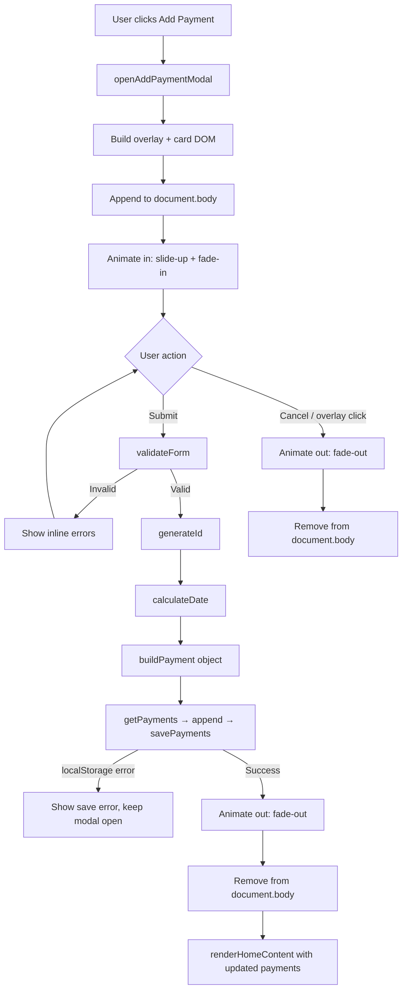

# Design Document: Add Payment

## Overview

The Add Payment feature lets users create and persist payment records from the AutoPay Manager home screen. When the user clicks "Add Payment" on the empty-state card, a modal form slides up over the current screen. The user fills in a payment name, amount, type (monthly or one-time), and date. On valid submission the payment is saved to localStorage and the dashboard re-renders immediately to show the new record.

The implementation is pure vanilla JS with inline styles, injected directly into `document.body` at open time and removed on close. No build tools, no frameworks, no external libraries. All styling follows the Blue + White design system already established in `auth/index.html`.

### Key Design Decisions

- **Modal lifecycle**: inject on open, remove on close — no hidden/display-none toggling.
- **Single entry point**: `openAddPaymentModal()` is the only public function; called from `createEmptyStateCard`'s `onAddPayment` callback.
- **Data layer reuse**: reads/writes via the existing `getPayments()` / `savePayments()` functions in `auth/auth.js`.
- **Dashboard refresh**: calls the existing `renderHomeContent()` after a successful save.
- **ID generation**: `Date.now().toString(36) + Math.random().toString(36).slice(2)` — no dependency needed.
- **Monthly next-due-date**: same day-of-month in the following calendar month using `Date` arithmetic; clamps to last day of month when needed.
- **Inline styles only**: matches the existing `auth/index.html` pattern; no external CSS files or class-based stylesheets.

---

## Architecture

The feature is a single self-contained function `openAddPaymentModal()` added to `auth/auth.js`. It owns the full lifecycle: DOM creation → animation in → user interaction → validation → save → animation out → DOM removal → dashboard refresh.



### Integration Points

| Existing symbol | Location | How used |
|---|---|---|
| `getPayments()` | `auth/auth.js` | Load current payments array before appending |
| `savePayments(arr)` | `auth/auth.js` (to be confirmed present or added) | Persist updated array to localStorage |
| `renderHomeContent(txns, container)` | `auth/auth.js` | Re-render `#homeContentArea` after save |
| `createEmptyStateCard({ onAddPayment })` | `auth/auth.js` | Passes `openAddPaymentModal` as the callback |

> Note: `savePayments` is referenced in requirements but not yet present in `auth/auth.js`. It will be added alongside `openAddPaymentModal` following the same pattern as `getPayments`.

---

## Components and Interfaces

### `openAddPaymentModal()`

Public entry point. No parameters. No return value.

Responsibilities:
1. Guard against double-open (check if overlay already exists in DOM).
2. Build and append the modal DOM tree.
3. Trigger the animate-in transition.
4. Wire up all event listeners (submit, cancel, overlay click).

### `_buildModalDOM()` (internal)

Returns `{ overlay, card, form, fields, errors }` — the full DOM tree as a plain object so event wiring stays in `openAddPaymentModal`.

### `_validateForm(fields)` (internal)

```
Input:  { name, amount, type, date }  (raw string values from inputs)
Output: { valid: boolean, errors: { name?, amount?, date? } }
```

Validation rules:
- `name`: non-empty after trim
- `amount`: non-empty, parseable as float, value > 0
- `date`: non-empty

### `_generateId()` (internal)

```
Output: string  — Date.now().toString(36) + Math.random().toString(36).slice(2)
```

### `_calculateDate(dateStr, type)` (internal)

```
Input:  dateStr — ISO date string from <input type="date"> (YYYY-MM-DD)
        type    — 'monthly' | 'one-time'
Output: ISO 8601 date string (YYYY-MM-DD)
```

Logic for `monthly`:
1. Parse `dateStr` into a `Date` object.
2. Record `targetDay = date.getDate()`.
3. Advance month by 1 (handle December → January + year increment).
4. Set day to `Math.min(targetDay, daysInMonth(nextYear, nextMonth))`.
5. Return as `YYYY-MM-DD` string.

For `one-time`: return `dateStr` unchanged.

### `savePayments(arr)` (to be added to auth.js)

```
Input:  Payment[]
Output: void  (throws on localStorage error)
```

Writes `JSON.stringify(arr)` to `localStorage` under key `autopay_payments`.

### Updated `createEmptyStateCard`

The existing call to `showScreen('addPaymentScreen')` inside `renderHomeContent` will be replaced with `openAddPaymentModal`.

---

## Data Models

### Payment object (stored in localStorage)

```js
{
  id:     string,   // e.g. "lf3k2abc9xz4"
  name:   string,   // e.g. "Netflix Subscription"
  amount: number,   // e.g. 649
  date:   string,   // ISO 8601 date string, e.g. "2025-08-15"
  type:   'monthly' | 'one-time',
  status: 'active'
}
```

### PaymentFormData (transient, never stored)

```js
{
  name:   string,   // raw input value
  amount: string,   // raw input value (parsed to number on save)
  type:   'monthly' | 'one-time',
  date:   string    // YYYY-MM-DD from <input type="date">
}
```

### localStorage schema

```
Key:   "autopay_payments"
Value: JSON array of Payment objects
```

`getPayments()` returns `[]` on missing key or parse error (already implemented). `savePayments()` writes the full array; any thrown error is caught by the caller and surfaced as a user-visible error message.

### Validation error map

```js
{
  name?:   string,  // "Payment name is required"
  amount?: string,  // "Amount is required" | "Amount must be greater than 0"
  date?:   string   // "Date is required"
}
```

---

## Modal DOM Structure

```
document.body
└── div#apModal-overlay          (position:fixed; inset:0; background:rgba(0,0,0,0.5); z-index:1000)
    └── div#apModal-card         (position:relative; background:#fff; border-radius:16px; max-width:400px; padding:24px; margin:auto)
        ├── h2                   "Add Payment"
        ├── form#apModal-form
        │   ├── label + input[name]
        │   ├── p.error[name]
        │   ├── label + input[amount]
        │   ├── p.error[amount]
        │   ├── label + select[type]
        │   ├── label + input[date]
        │   ├── p.error[date]
        │   └── div.buttons
        │       ├── button[cancel]
        │       └── button[submit]  "Add Payment"
        └── p#apModal-saveError  (hidden by default)
```

The overlay is the scroll/click target. The card is centred via flexbox on the overlay (`display:flex; align-items:center; justify-content:center`).

---

## Animation Spec

| Event | Element | Animation |
|---|---|---|
| Open | card | `translateY(40px)→translateY(0)`, `opacity:0→1`, `0.3s ease-out` |
| Close (success / cancel) | overlay | `opacity:1→0`, `0.25s ease-in`, then `remove()` |

Implemented via direct style mutation + `requestAnimationFrame` (same pattern as `showScreen` in auth.js).

---

## Error Handling

| Scenario | Behaviour |
|---|---|
| Empty / whitespace name | Inline error below name field; form not submitted |
| Empty amount | Inline error below amount field |
| Amount ≤ 0 | Inline error "Amount must be greater than 0" |
| Empty date | Inline error below date field |
| localStorage unavailable | Save error message shown inside modal; modal stays open |
| Double-open attempt | Second call is a no-op (guard checks for existing overlay) |
| `renderHomeContent` called with no container | Already guarded in existing implementation |

Inline errors are cleared as soon as the user modifies the offending field (`input` / `change` event).

---

## Testing Strategy

### Unit Tests

Focus on specific examples, edge cases, and integration points:

- `_validateForm` with all-valid input returns `{ valid: true }`.
- `_validateForm` with empty name returns error for name only.
- `_validateForm` with amount = "0" returns "Amount must be greater than 0".
- `_validateForm` with amount = "-5" returns amount error.
- `_validateForm` with whitespace-only name returns name error.
- `_calculateDate` for one-time returns the input date unchanged.
- `_calculateDate` for monthly on Jan 31 returns Feb 28 (or 29 in leap year).
- `_calculateDate` for monthly on Dec 15 returns Jan 15 of next year.
- `_generateId` returns a non-empty string.
- `savePayments` followed by `getPayments` returns the same array (round-trip).
- Modal does not open a second instance when already open.

### Property-Based Tests

Use a property-based testing library (e.g. **fast-check** for JS) with minimum 100 iterations per property.

Each test is tagged: `// Feature: add-payment, Property N: <property_text>`

Properties are defined in the Correctness Properties section below.

---

## Correctness Properties

*A property is a characteristic or behavior that should hold true across all valid executions of a system — essentially, a formal statement about what the system should do. Properties serve as the bridge between human-readable specifications and machine-verifiable correctness guarantees.*

### Property 1: Form fields reset on each open

*For any* sequence of open/close cycles of the AddPaymentModal, each fresh open should produce a form where all fields (name, amount, date) are empty and the type select is at its default value.

**Validates: Requirements 1.5, 10.4**

---

### Property 2: Whitespace-only name is rejected

*For any* string composed entirely of whitespace characters submitted as the payment name, `_validateForm` should return `valid: false` with a non-empty error for the name field, and no payment should be written to localStorage.

**Validates: Requirements 3.1**

---

### Property 3: Empty amount is rejected

*For any* form submission where the amount field is empty, `_validateForm` should return `valid: false` with a non-empty error for the amount field.

**Validates: Requirements 3.2**

---

### Property 4: Non-positive amount is rejected

*For any* numeric amount value that is zero or negative, `_validateForm` should return `valid: false` with the error "Amount must be greater than 0" for the amount field.

**Validates: Requirements 3.3**

---

### Property 5: Empty date is rejected

*For any* form submission where the date field is empty, `_validateForm` should return `valid: false` with a non-empty error for the date field.

**Validates: Requirements 3.4**

---

### Property 6: Invalid input never reaches localStorage

*For any* combination of form inputs that fails validation (invalid name, amount, or date), calling the submit handler should leave the `autopay_payments` localStorage entry completely unchanged.

**Validates: Requirements 3.7**

---

### Property 7: Generated IDs are unique across saves

*For any* collection of N payments generated in the same session (N ≥ 2), no two payments should share the same `id` value.

**Validates: Requirements 4.1, 4.3**

---

### Property 8: Monthly date calculation is correct and ISO-formatted

*For any* valid ISO date string and payment type `monthly`, `_calculateDate` should return a string where: (a) the month is exactly one calendar month after the input month, (b) the day is the same as the input day or clamped to the last day of the target month if the target month is shorter, and (c) the result matches the ISO 8601 `YYYY-MM-DD` format. This property covers the end-of-month edge case (e.g. Jan 31 → Feb 28/29).

**Validates: Requirements 5.1, 5.2**

---

### Property 9: One-time date is returned unchanged and ISO-formatted

*For any* valid ISO date string and payment type `one-time`, `_calculateDate` should return the exact same date string, confirming no transformation is applied and the format is preserved.

**Validates: Requirements 5.3, 5.4**

---

### Property 10: Save round-trip preserves all payment fields

*For any* valid Payment object, calling `savePayments` with an array containing that payment and then calling `getPayments` should return an array containing an object with identical `id`, `name`, `amount`, `date`, `type`, and `status` fields. The `status` field must equal `'active'`.

**Validates: Requirements 6.1, 6.3, 6.4**

---

## Error Handling

| Scenario | Behaviour |
|---|---|
| Empty / whitespace name on submit | Inline error "Payment name is required" below name field; no save attempted |
| Empty amount on submit | Inline error "Amount is required" below amount field |
| Amount ≤ 0 on submit | Inline error "Amount must be greater than 0" below amount field |
| Empty date on submit | Inline error "Date is required" below date field |
| User corrects a field with an error | That field's error is cleared immediately on `input`/`change` |
| localStorage write throws | Save error message shown inside modal (`#apModal-saveError`); modal stays open; no DOM removal |
| `openAddPaymentModal` called while modal is already open | No-op — guard checks `document.getElementById('apModal-overlay')` |
| `renderHomeContent` called with null container | Already guarded in existing implementation; no action taken |

---

## Testing Strategy

### Dual Testing Approach

Both unit tests and property-based tests are required. They are complementary:
- Unit tests catch concrete bugs at specific inputs and integration boundaries.
- Property tests verify universal correctness across the full input space.

### Unit Tests (specific examples and integration)

- `openAddPaymentModal()` appends overlay to `document.body`.
- Calling `openAddPaymentModal()` twice results in exactly one overlay in the DOM.
- Clicking cancel removes the overlay from `document.body`.
- Clicking the overlay backdrop removes the modal from `document.body`.
- After a successful save, `document.body` contains no modal overlay.
- After a successful save, `renderHomeContent` is called with the updated payments array.
- `_calculateDate('2025-01-31', 'monthly')` returns `'2025-02-28'`.
- `_calculateDate('2024-01-31', 'monthly')` returns `'2024-02-29'` (leap year).
- `_calculateDate('2025-12-15', 'monthly')` returns `'2026-01-15'`.
- `_generateId()` returns a non-empty string.
- localStorage error during save shows `#apModal-saveError` and keeps modal open.

### Property-Based Tests

Library: **fast-check** (zero-dependency, works in vanilla JS environments via CDN or npm).

Configuration: minimum **100 iterations** per property test.

Each test is tagged with a comment in the format:
`// Feature: add-payment, Property N: <property_text>`

| Property | Test description | fast-check arbitraries |
|---|---|---|
| P1 | Form fields reset on each open | `fc.integer({ min: 1, max: 10 })` for open/close count |
| P2 | Whitespace name rejected | `fc.stringOf(fc.constantFrom(' ', '\t', '\n'))` |
| P3 | Empty amount rejected | constant `''` |
| P4 | Non-positive amount rejected | `fc.float({ max: 0 })` |
| P5 | Empty date rejected | constant `''` |
| P6 | Invalid input never reaches localStorage | `fc.record({ name: fc.constant(''), amount: fc.float({ max: 0 }), date: fc.constant('') })` |
| P7 | ID uniqueness | `fc.integer({ min: 2, max: 50 })` for count of IDs to generate |
| P8 | Monthly date calculation | `fc.integer({ min: 2000, max: 2099 })` × `fc.integer({ min: 1, max: 12 })` × `fc.integer({ min: 1, max: 28 })` (plus end-of-month edge cases) |
| P9 | One-time date passthrough | `fc.date()` mapped to `YYYY-MM-DD` string |
| P10 | Save round-trip | `fc.record({ name: fc.string(), amount: fc.float({ min: 0.01 }), type: fc.constantFrom('monthly','one-time'), date: fc.string() })` |

Each correctness property must be implemented by a **single** property-based test referencing the property number above.
