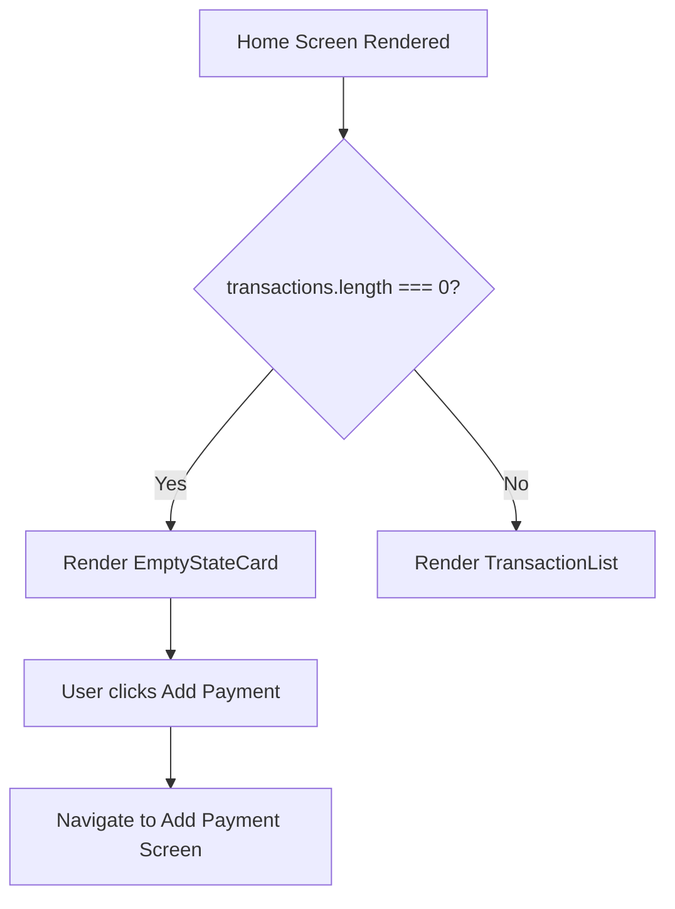
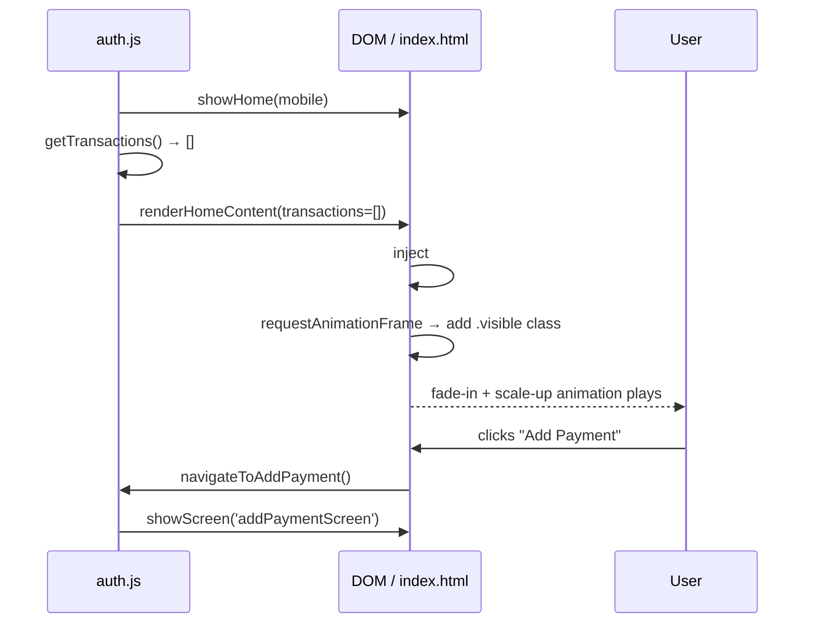

# Design Document: Empty State UX

## Overview

When the AutoPay Manager home screen has no transactions (i.e. `transactions.length === 0` or total balance is ₹0.00), a clean, helpful empty state component replaces the blank space below the balance card. It guides the user toward their first action — adding a payment — using a minimal card with an icon, copy, and a primary CTA button, all consistent with the Blue + White theme.

The feature applies to the vanilla JS home screen in `auth/index.html` / `auth/auth.js` and is designed to be portable to any future React-based home screen as well.

---

## Architecture



---

## Sequence Diagrams

### Empty State Appearance Flow



---

## Components and Interfaces

### Component: EmptyStateCard

**Purpose**: Displayed below the balance card when there are no transactions. Communicates zero-data state and prompts the user to take action.

**Interface** (vanilla JS factory function):

```javascript
/**
 * Creates and returns the empty state DOM element.
 * @param {Object} options
 * @param {Function} options.onAddPayment - callback when CTA is clicked
 * @returns {HTMLElement}
 */
function createEmptyStateCard({ onAddPayment }) { ... }
```

**Responsibilities**:
- Render icon container, title, subtitle, and CTA button
- Apply fade-in + scale-up animation on mount
- Invoke `onAddPayment` callback on button click

### Component: HomeContentRenderer

**Purpose**: Decides whether to render `EmptyStateCard` or `TransactionList` based on data state.

**Interface**:

```javascript
/**
 * Renders the correct content section below the balance card.
 * @param {Array} transactions - current transaction array
 * @param {HTMLElement} container - DOM node to render into
 */
function renderHomeContent(transactions, container) { ... }
```

**Responsibilities**:
- Check `transactions.length === 0`
- Mount/unmount `EmptyStateCard` or `TransactionList` accordingly
- Called from `showHome()` in `auth.js`

---

## Data Models

### Transaction (existing, inferred)

```javascript
// Inferred from current balance card showing ₹0 Sent / ₹0 Received
{
  id: string,
  type: 'sent' | 'received',
  amount: number,       // in rupees
  timestamp: number,    // epoch ms
  label: string
}
```

### EmptyStateConfig

```javascript
{
  icon: SVGString,          // inline SVG markup
  title: string,            // "No transactions yet"
  subtitle: string,         // "Start by adding your first payment"
  ctaLabel: string,         // "Add Payment"
  onAddPayment: Function    // navigation callback
}
```

---

## Key Functions with Formal Specifications

### createEmptyStateCard(options)

```javascript
function createEmptyStateCard({ onAddPayment })
```

**Preconditions:**
- `onAddPayment` is a callable function
- DOM is ready (called after `DOMContentLoaded`)

**Postconditions:**
- Returns a single `HTMLElement` (`<div>`) with class `empty-state-card`
- Element contains icon container, title `<h3>`, subtitle `<p>`, and CTA `<button>`
- CTA button click triggers `onAddPayment()`
- Element starts with `opacity: 0; transform: scale(0.95)` for animation

**Side effects:** None — pure DOM construction, no global state mutation.

---

### renderHomeContent(transactions, container)

```javascript
function renderHomeContent(transactions, container)
```

**Preconditions:**
- `transactions` is an Array (may be empty)
- `container` is a valid, mounted `HTMLElement`

**Postconditions:**
- If `transactions.length === 0`: `container` contains exactly one `EmptyStateCard`
- If `transactions.length > 0`: `container` contains the transaction list; no `EmptyStateCard` present
- Previous content of `container` is cleared before re-render

**Loop Invariants:** N/A (no loops in render path)

---

## Algorithmic Pseudocode

### Main Render Decision Algorithm

```pascal
PROCEDURE renderHomeContent(transactions, container)
  INPUT: transactions: Array, container: HTMLElement
  OUTPUT: void (DOM mutation)

  BEGIN
    container.innerHTML ← ''

    IF transactions.length = 0 THEN
      card ← createEmptyStateCard({ onAddPayment: navigateToAddPayment })
      container.appendChild(card)
      scheduleAnimation(card)
    ELSE
      list ← createTransactionList(transactions)
      container.appendChild(list)
    END IF
  END
END PROCEDURE
```

### Animation Schedule Algorithm

```pascal
PROCEDURE scheduleAnimation(element)
  INPUT: element: HTMLElement (opacity=0, scale=0.95)
  OUTPUT: void

  BEGIN
    // Defer to next paint frame so initial styles are applied
    requestAnimationFrame(() =>
      element.style.opacity    ← '1'
      element.style.transform  ← 'scale(1)'
      element.style.transition ← 'opacity 0.35s ease-out, transform 0.35s ease-out'
    )
  END
END PROCEDURE
```

---

## Example Usage

```javascript
// In auth.js — showHome() updated to call renderHomeContent
function showHome(m) {
  document.getElementById('welcomeMsg').textContent = `+91 ${m}`;
  document.getElementById('settingsMobile').textContent = `+91 ${m}`;
  showScreen('homeScreen');

  const transactions = getTransactions(); // [] initially
  const container = document.getElementById('homeContentArea');
  renderHomeContent(transactions, container);
}

// createEmptyStateCard usage
const card = createEmptyStateCard({
  onAddPayment: () => showScreen('addPaymentScreen')
});
document.getElementById('homeContentArea').appendChild(card);
```

---

## Correctness Properties

*A property is a characteristic or behavior that should hold true across all valid executions of a system — essentially, a formal statement about what the system should do. Properties serve as the bridge between human-readable specifications and machine-verifiable correctness guarantees.*

### Property 1: Empty array renders exactly one EmptyStateCard and no TransactionList

*For any* call to `renderHomeContent` with an empty transactions array, the Container SHALL contain exactly one element with class `empty-state-card` and zero elements representing a transaction list.

**Validates: Requirements 1.1, 1.2**

---

### Property 2: Non-empty array renders TransactionList and no EmptyStateCard

*For any* call to `renderHomeContent` with a non-empty transactions array, the Container SHALL contain the transaction list and zero elements with class `empty-state-card`.

**Validates: Requirements 1.3, 1.4**

---

### Property 3: Container content invariant

*For any* transactions array (empty or non-empty), after `renderHomeContent` completes the Container SHALL contain exactly one of either the EmptyStateCard or the TransactionList — never both, never neither.

**Validates: Requirements 6.1**

---

### Property 4: Re-render clears previous content

*For any* two sequential calls to `renderHomeContent` on the same Container with different inputs, the Container after the second call SHALL contain only the content produced by the second call, with no remnants from the first.

**Validates: Requirements 1.5**

---

### Property 5: EmptyStateCard structural completeness

*For any* valid options object passed to `createEmptyStateCard`, the returned element SHALL have class `empty-state-card`, contain an SVG icon, an `<h3>` with text "No transactions yet", a `<p>` with text "Start by adding your first payment", and a `<button>` with label "Add Payment".

**Validates: Requirements 2.1, 2.2, 2.3, 2.4, 2.5**

---

### Property 6: CTA callback invoked exactly once per click

*For any* callback function passed as `onAddPayment`, a single click on the CTA button SHALL invoke that callback exactly once and not zero or more than once.

**Validates: Requirements 3.1**

---

### Property 7: EmptyStateCard initial animation state

*For any* call to `createEmptyStateCard`, the returned element SHALL have `opacity: 0` and `transform: scale(0.95)` set as initial inline styles before being appended to the DOM.

**Validates: Requirements 4.1**

---

### Property 8: Animation resets on every mount

*For any* number of times the EmptyStateCard is mounted into the Container, each mount SHALL start with `opacity: 0` and `transform: scale(0.95)` before the `requestAnimationFrame` callback fires.

**Validates: Requirements 4.4**

---

### Property 9: Theme colour compliance

*For any* call to `createEmptyStateCard`, the returned element SHALL use `#EEF1FF` for the icon container background, `linear-gradient(135deg, #3D5AFE, #6B8EFF)` for the CTA button background, `#1A1A2E` for the title colour, `#6B7280` for the subtitle colour, and `#FFFFFF` for the CTA button text colour.

**Validates: Requirements 5.1, 5.2, 5.3, 5.4, 5.5, 5.6**

---

## Error Handling

### Scenario 1: `onAddPayment` not provided

**Condition**: `createEmptyStateCard` called without a callback  
**Response**: Default to a no-op function; button renders but does nothing  
**Recovery**: Log a console warning in development

### Scenario 2: `container` element not found in DOM

**Condition**: `renderHomeContent` called before `homeScreen` is active  
**Response**: Guard with `if (!container) return;` — silently skip render  
**Recovery**: `showHome()` always activates `homeScreen` before calling render, so this is a safety net only

### Scenario 3: `transactions` is null/undefined

**Condition**: Data source returns null instead of empty array  
**Response**: Treat as empty — `const txns = transactions ?? []`  
**Recovery**: Renders empty state correctly

---

## Testing Strategy

### Unit Testing Approach

- Test `createEmptyStateCard` returns correct DOM structure (icon, title, subtitle, button)
- Test `renderHomeContent([])` mounts empty state and clears container
- Test `renderHomeContent([tx1])` mounts transaction list, no empty state present
- Test CTA button click fires `onAddPayment` callback

### Property-Based Testing Approach

**Property Test Library**: fast-check

- For any array of length 0, `renderHomeContent` always produces exactly one `.empty-state-card` element
- For any non-empty array, `renderHomeContent` never produces a `.empty-state-card` element
- `createEmptyStateCard` always returns an HTMLElement regardless of valid callback shapes

### Integration Testing Approach

- Simulate `showHome()` call with empty localStorage transactions → verify `#homeContentArea` contains empty state
- Simulate clicking "Add Payment" → verify `addPaymentScreen` becomes active

---

## Performance Considerations

- Empty state card is a lightweight DOM node (~5 elements); no performance concern
- Animation uses `opacity` and `transform` only — GPU-composited, no layout thrash
- `requestAnimationFrame` ensures animation triggers after first paint, avoiding flash

---

## Security Considerations

- No user input is accepted in the empty state component
- CTA navigation uses the existing `showScreen()` function — no URL manipulation or eval
- No external resources loaded by this component

---

## Dependencies

- Existing `showScreen(id)` utility in `auth.js` — used for CTA navigation
- Tailwind CDN (already loaded in `auth/index.html`) — optional utility classes
- No new external libraries required
